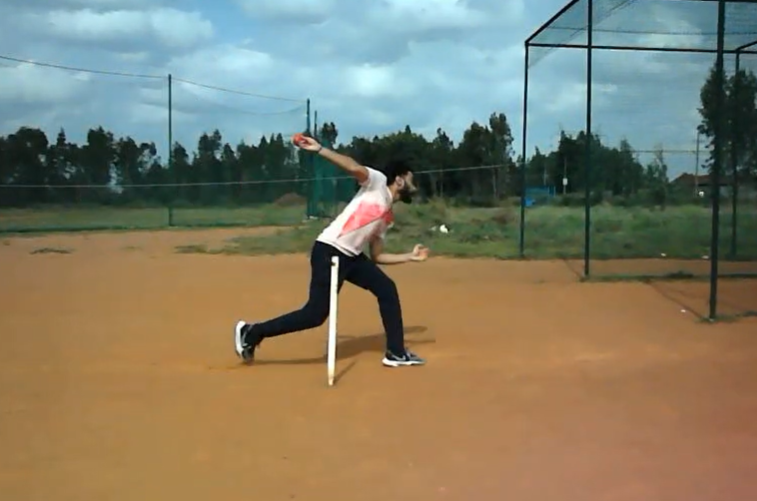
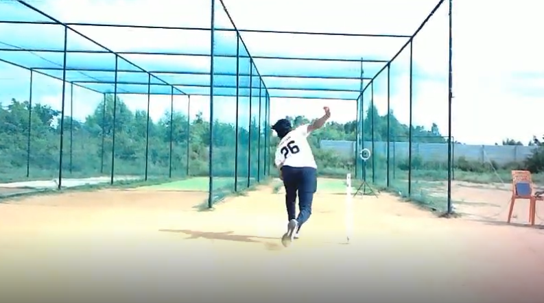
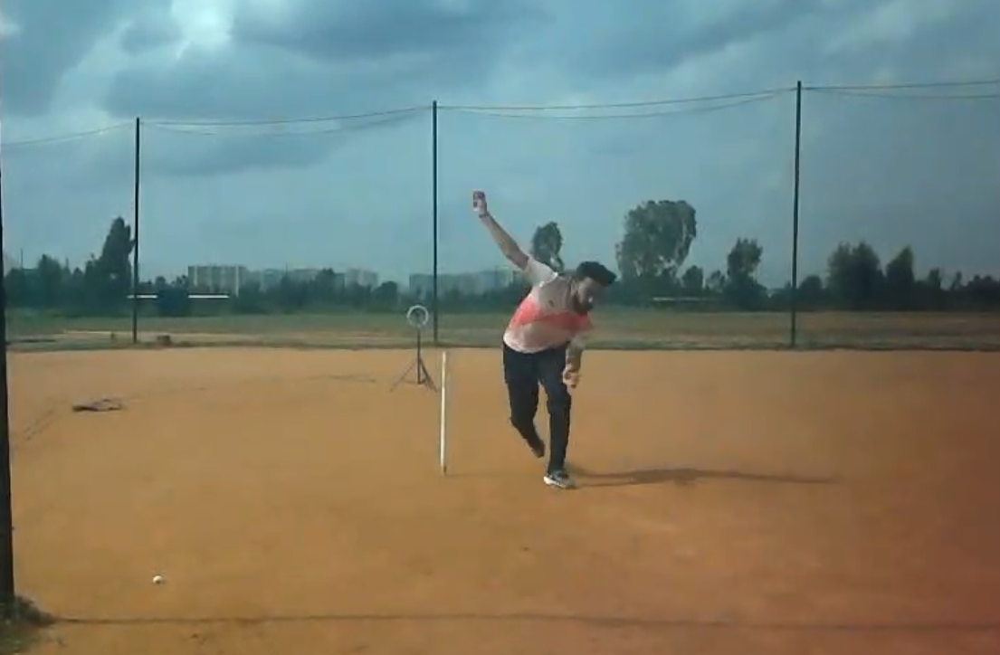

# Cricket Video Analysis Project

A comprehensive biomechanical analysis system for cricket bowling videos that extracts pose data, detects bowling phases, calculates performance metrics, and generates annotated output videos across multiple camera views.

## 🎯 Project Overview

This system provides scientific-grade biomechanical analysis of cricket bowling technique using AI-powered pose estimation, advanced phase detection algorithms, and real-world measurement conversion. It processes multi-view video inputs and generates detailed performance metrics with professional-quality annotated videos.

## 📦 Dependencies & Installation

### Required Python Packages

```bash
pip install opencv-python>=4.8.0
pip install mediapipe>=0.10.0
pip install numpy>=1.24.0
pip install pandas>=2.0.0
pip install matplotlib>=3.7.0
pip install Pillow>=10.0.0
pip install PyExifTool>=0.5.6
```

Or install from requirements.txt:
```bash
pip install -r requirements.txt
```

## 🚀 Quick Start

### Multi-View Analysis
```bash
# Complete 3-view analysis (side, back, front)
python main.py side_view.mp4 back_view.mp4 front_view.mp4

# 2-view analysis (side and back - minimum required)
python main.py side_view.mp4 back_view.mp4
```

### Standalone Runup Analysis
```bash
python runup_metrics.py runup_video.mp4 --output-dir runup_analysis
```

## 📷 Camera Views & Setup

The system analyzes cricket bowling from three distinct camera perspectives, each providing unique biomechanical insights:

| **Side View** | **Back View** | **Front View** |
|:---:|:---:|:---:|
|  |  |  |
| **Primary Analysis View** | **Timing & Alignment** | **Lateral Mechanics** |
| • Phase detection (master view) | • FFC to release timing | • Shoulder-hip separation |
| • Knee dynamics & angles | • Hip-shoulder alignment | • Trunk lateral flexion |
| • Trunk forward flexion | • Bowling arm abduction | • Step width & foot alignment |
| • Release height & stride length | • Pelvic drop analysis | • Release point positioning |

### Camera Positioning Requirements
- **Side View**: Perpendicular to bowling direction, full body visible throughout action
- **Back View**: Directly behind bowler, capturing run-up and delivery stride  
- **Front View**: Facing the bowler, showing frontal body alignment and lateral movement


## 🔄 Processing Pipeline

### Step 1: Pose Estimation (`pose_est.py`)
- **AI-Powered Analysis**: Uses Google's MediaPipe Pose model
- **33 Landmark Extraction**: Captures full body pose per frame
- **View-Specific Tuning**: Optimized confidence thresholds per camera angle
- **Output**: `*_<view>_keypoints.json` files with per-frame pose coordinates

### Step 2: Phase Detection (`phase.py`)
- **Master View Analysis**: Typically uses side view for phase detection
- **Bowling Phases Detected**:
  - **Run-up**: Approach phase before bound
  - **Bound**: Flight phase (lowest torso trajectory with parabolic validation)
  - **BFC**: Back Foot Contact (determined by ankle height comparison)
  - **FFC**: Front Foot Contact (multi-criteria: heel/toe + ankle proximity)  
  - **Release**: Ball release point (±30° overhead cone + peak wrist velocity)
  - **Follow-through**: Post-release phase
- **Advanced Algorithms**: 
  - Parabolic bound validation for genuine flight detection
  - Multi-criteria FFC detection (heel/toe contact + ankle validation)
  - Cone-based release detection with velocity confirmation
  - Ground level reference using back foot position
- **Cross-View Synchronization**: Applies phases to all camera views
- **Output**: `*_<view>_phased.json` files with phase-labeled data

### Step 3: Biomechanical Metrics (`*_metrics.py`)

#### Side View Metrics (18 total)
- **Knee Dynamics**: 
  - Front/back knee angles (3-point calculation: hip-knee-ankle)
  - Extension velocity (multi-frame derivative with smoothing)
  - Collapse/flexion analysis with trail tracking
- **Trunk Analysis**: 
  - Forward flexion (trunk-to-vertical angle using hip-shoulder midpoints)
  - Peak flexion velocity (temporal derivative at release)
- **Performance**: 
  - Release height (wrist-to-ground using heel reference)
  - Bound height/flight time (torso trajectory analysis)
  - Stride length (BFC to FFC foot separation)
- **Advanced**: 
  - Bowling arm hyperextension (elbow angle during delivery)
  - Lead arm drop speed (non-bowling arm velocity analysis)
- **Composite**: 
  - Directional efficiency score (multi-factor forward momentum preservation)
  - Sequencing lag analysis (kinetic chain timing from FFC to release)
- **Classification**: Front leg kinematics (flexor/extender/constant brace patterns)

#### Front View Metrics (9 total)
- **Shoulder-Hip Dynamics**: 
  - Separation angle (shoulder line vs hip line orientation difference)
  - Separation velocity (temporal rate of angle change)
- **Lateral Analysis**: 
  - Trunk lateral flexion (deviation from vertical in frontal plane)
  - Peak flexion rate (maximum lateral movement velocity)
- **Spatial**: 
  - Step width (lateral distance between feet at FFC)
  - Foot lateral offset (front foot position relative to hip center)
  - Pelvic drop (hip height difference between left and right)
- **Release**: 
  - Wrist-finger midpoint (precise release point coordinates)
  - Foot alignment angle (front foot orientation at release)
  - Arm slot angle (bowling arm position relative to vertical)

#### Back View Metrics (4 total)
- **Timing**: 
  - FFC to release duration (frame-by-frame temporal analysis)
  - Delivery phase breakdown (sub-phase timing within delivery stride)
- **Alignment**: 
  - Hip-shoulder separation (rotational alignment at release)
  - Pelvic drop (lateral hip stability during delivery)
- **Arm Position**: 
  - Bowling arm abduction angle (shoulder-to-elbow angle with vertical)

### Step 4: Unit Conversion (`unit_conversion.py`)
- **Real-World Scaling**: 
  - Side view: Elbow-to-wrist = 30cm reference
  - Front/Back views: Hip-to-hip = 35cm reference
- **Conversions**: Pixels → centimeters, velocities → km/hr
- **Scaling Strategies**: Median vs frame-specific scaling
- **Output**: `*_<view>_metrics.json` with real-world units

### Step 5: Video Annotation (`annotate_video.py`)
- **Visual Overlays**: Pose skeleton, phase labels, metric displays
- **Smart Visualization**: Context-aware metric positioning
- **Slow Motion**: Automatic speed reduction for key events
- **Trail Analysis**: Knee movement pattern visualization
- **Output**: `*_<view>_annotated.mp4` enhanced videos

## 📁 File Structure

```
FINAL_PROD_CRIC/
├── main.py                    # Main orchestration script
├── pose_est.py               # Pose estimation using MediaPipe
├── phase.py                  # Bowling phase detection & synchronization
├── side_metrics.py           # Side view biomechanical calculations
├── front_metrics.py          # Front view biomechanical calculations  
├── back_metrics.py           # Back view biomechanical calculations
├── unit_conversion.py        # Real-world measurement conversion
├── annotate_video.py         # Video annotation and visualization
├── runup_metrics.py          # Standalone runup analysis module
└── requirements.txt          # Python dependencies
```

## 📊 Output Files

For each input video, the system generates:

```
├── video_side_keypoints.json     # Raw pose keypoints
├── video_side_phased.json        # Phase-labeled keypoints
├── video_side_metrics.json       # Biomechanical metrics (real units)
├── video_side_annotated.mp4      # Enhanced analysis video
└── [similar files for front/back views]
```

## 🎯 Key Features

### Advanced Phase Detection
- **Parabolic Bound Validation**: Ensures accurate flight phase detection
- **Cone-Based Release**: ±30° overhead cone + velocity analysis
- **Cross-View Synchronization**: Master view drives all camera angles

### Real-World Measurements  
- **Anatomical References**: Uses body proportions for scaling
- **Dynamic Scaling**: Frame-specific vs median scaling strategies
- **Professional Units**: Centimeters, kilometers/hour, degrees

### Intelligent Video Processing
- **View-Specific Tuning**: Optimized pose detection per camera angle
- **Context-Aware Display**: Metrics appear at relevant frames
- **Professional Annotation**: Slow-motion key events, trail visualization

### Multi-View Analysis
- **Flexible Input**: 2-3 camera setup support
- **Comprehensive Coverage**: Side (technique), Front (alignment), Back (timing)
- **Synchronized Analysis**: Consistent frame-level metrics across views

## 🔬 Technical Implementation

### Pose Estimation
- **MediaPipe Integration**: Google's state-of-the-art pose model
- **33-Point Tracking**: Full body landmark detection
- **Confidence Thresholds**: View-specific optimization
- **Visibility Filtering**: Quality-based keypoint inclusion

### Phase Detection Algorithm
```python
# Simplified phase detection flow
1. Detect bound phase (lowest torso trajectory with parabolic validation)
2. Identify BFC (back foot contact after bound)
3. Find FFC (front foot ground contact)  
4. Locate release (overhead cone + peak velocity)
5. Synchronize phases across all views
```

## 🧮 Calculation Methods & Algorithms

### Key Phase Detection Methods

#### 1. **Bound Phase Detection**
- **Method**: Analyzes torso trajectory (hip midpoint) to find the lowest point during flight
- **Algorithm**: Parabolic validation ensures genuine flight phase vs ground contact
- **Output**: Start and end frames of the bound phase

#### 2. **Back Foot Contact (BFC) Detection**  
- **Method**: Identifies the landing foot after bound phase using ankle Y-coordinates
- **Algorithm**: 
  ```python
  # Determine back foot by comparing ankle heights at bound end
  back_foot = 'left' if left_ankle_y > right_ankle_y else 'right'
  bfc_frame = bound_end_frame
  ```
- **Key Insight**: Back foot is determined by which ankle is lower (touching ground first)

#### 3. **Front Foot Contact (FFC) Detection**
- **Method**: Detects when front foot makes ground contact after BFC
- **Algorithm**:
  ```python
  # Multi-criteria ground contact detection
  1. Search 0.4 seconds after BFC
  2. Check heel OR toe touching ground level (±5px tolerance)
  3. Verify ankle is near ground (±25px tolerance)
  4. Classify contact: 'heel_first', 'toe_first', or 'flat'
  ```
- **Ground Reference**: Uses back foot position at BFC as ground level baseline

#### 4. **Release Point Detection** 
- **Method**: Advanced cone-based detection with velocity analysis
- **Primary Algorithm**:
  ```python
  # Overhead cone detection (±30° from vertical)
  1. Search 1.5 seconds after FFC
  2. Check if bowling arm wrist is in ±30° cone above shoulder
  3. Within cone frames, find peak wrist velocity
  4. Release = frame before peak velocity (still in cone)
  ```
- **Fallback**: If cone criteria not met, uses traditional velocity-only approach
- **Key Features**: 
  - Ensures anatomically correct overhead position
  - Combines spatial (cone) and temporal (velocity) criteria

### Biomechanical Metric Calculations

#### **Release Height Calculation**
```python
# Method: Wrist position relative to ground at release
1. Get bowling arm wrist Y-coordinate at release frame
2. Use higher heel position as ground reference
3. Calculate absolute height: ground_y - wrist_y (converted to cm)
```

#### **Joint Angle Calculations**
```python
# Standard 3-point angle calculation
def calculate_angle(point_a, vertex_b, point_c):
    # Vectors from vertex to each point
    vec1 = (a.x - b.x, a.y - b.y)  
    vec2 = (c.x - b.x, c.y - b.y)
    
    # Dot product and magnitudes
    dot_product = vec1[0]*vec2[0] + vec1[1]*vec2[1]
    mag1 = sqrt(vec1[0]² + vec1[1]²)
    mag2 = sqrt(vec2[0]² + vec2[1]²)
    
    # Angle in degrees
    return degrees(acos(dot_product / (mag1 * mag2)))
```

#### **Velocity Calculations**
```python
# Multi-frame derivative with smoothing
1. Calculate position differences across time windows
2. Apply smoothing filters for noise reduction  
3. Convert pixel/frame to real-world units (cm/s, km/h)
```

#### **Trunk Flexion Analysis**
- **Forward Flexion**: Angle between trunk line (hip-to-shoulder) and vertical
- **Lateral Flexion**: Deviation from vertical plane in frontal view
- **Calculation**: Uses shoulder and hip midpoints for trunk orientation

#### **Arm Slot Angle** (Front View)
```python
# Bowling arm position relative to vertical at release
1. Calculate vector from shoulder to wrist
2. Measure angle with vertical axis (0° = straight up)
3. Provides arm slot classification (high, medium, low)
```

### Real-World Unit Conversion

#### **Scaling References**
- **Side View**: Elbow-to-wrist distance = 30cm (anatomical constant)
- **Front/Back Views**: Hip-to-hip distance = 35cm (anatomical constant)

#### **Conversion Process**
```python
# Dynamic scaling calculation
1. Extract reference measurements per frame
2. Calculate pixels-to-cm ratio: reference_cm / reference_pixels
3. Apply scaling to all measurements
4. Convert velocities: (pixels/frame) × scaling × fps = cm/s
```

#### **Scaling Strategies**
- **Median Scaling**: Uses median ratio across all frames (more stable)
- **Frame-Specific**: Individual frame scaling (more accurate for varying distances)

### Metric Calculations
- **Angle Calculations**: 3-point angle computation with bounds checking
- **Velocity Analysis**: Multi-frame derivatives with smoothing
- **Trail Tracking**: Historical position analysis for movement patterns
- **Composite Scores**: Weighted multi-factor performance indicators

## 🎥 Video Requirements

### Recommended Setup
- **Camera Positions**: Side (mandatory), Back (mandatory), Front (optional)
- **Frame Rate**: 30+ fps for smooth analysis
- **Resolution**: 720p minimum, 1080p preferred
- **Lighting**: Good lighting for pose detection accuracy
- **Subject Visibility**: Full body in frame throughout bowling action

### File Formats
- **Input**: MP4, AVI, MOV (any OpenCV-supported format)
- **Output**: MP4 with H.264 encoding

## 🛠️ Customization

### Adjusting Thresholds
```python
# In pose_est.py - modify confidence thresholds
min_tracking_confidence = 0.5  # Default for side/back
min_detection_confidence = 0.4  # Default for side/back

# For front view (more lenient)
min_tracking_confidence = 0.3
min_detection_confidence = 0.3
```

### Adding Custom Metrics
1. Add calculation function to appropriate `*_metrics.py` file
2. Include in `calculate_all_*_metrics()` function
3. Add visualization logic to `annotate_video.py`
4. Update unit conversion if needed

### Modifying Phase Detection
```python
# In phase.py - adjust phase detection parameters
time_window_ms = 120          # Analysis window for metrics
cone_angle_degrees = 30       # Release detection cone
search_window_seconds = 1.5   # Release search window
```

## 📈 Performance Metrics

### Accuracy
- **Pose Detection**: >95% landmark accuracy in good lighting
- **Phase Detection**: >90% accuracy for BFC/FFC/Release
- **Measurement Precision**: ±2cm for distance, ±3° for angles

### Processing Speed
- **Pose Estimation**: ~5-10x real-time (depends on hardware)
- **Total Pipeline**: ~15-30 minutes for 3 views of 10-second clips
- **Memory Usage**: ~2-4GB RAM for typical analysis

## 🔧 Troubleshooting

### Common Issues

**"No pose detected" warnings**
- Check lighting conditions
- Ensure full body is visible in frame
- Try adjusting confidence thresholds

**Phase detection failures**
- Verify side view quality (master view)
- Check if bowling action is complete in video
- Ensure clear bound phase visibility

**Unit conversion errors**
- Verify pose detection quality for reference points
- Check if elbow-wrist (side) or hip-hip (front/back) landmarks are visible

### Debug Mode
```python
# Enable verbose logging
import logging
logging.basicConfig(level=logging.DEBUG)
```

## 📚 Research Applications

This system has been designed for:
- **Biomechanical Research**: Detailed kinematic analysis
- **Coaching Applications**: Technique improvement identification
- **Performance Analysis**: Objective measurement of bowling efficiency
- **Injury Prevention**: Movement pattern analysis
- **Talent Development**: Technique standardization and comparison

## 🤝 Contributing

To contribute to this project:
1. Fork the repository
2. Create a feature branch
3. Implement changes with tests
4. Submit a pull request with detailed description

## 📄 License

This project is licensed under the MIT License - see the LICENSE file for details.

## 🙏 Acknowledgments

- **MediaPipe Team**: For the exceptional pose estimation model
- **OpenCV Community**: For comprehensive computer vision tools
- **Cricket Biomechanics Research**: For domain knowledge and validation

## 📞 Support

For technical support or research collaboration inquiries, please open an issue in the repository or contact the development team.

---

**Built with ❤️ for cricket biomechanics research and coaching applications**
